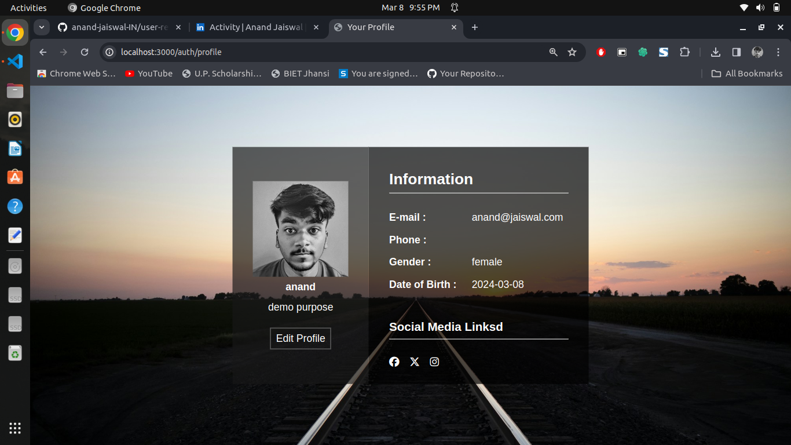

# User Registration System Project

This project implements a user registration system using Node.js and Express framework. Users can register, login, logout, view their profile, and upload details along with a profile photo. MongoDB, managed with Mongoose, is utilized as the database, while Cloudinary serves as the image storage solution.

## Screenshot





## Features

- User registration
- User login and logout
- Viewing user profiles
- Uploading details along with profile photos

## Technologies Used

- Node.js
- Express.js
- MongoDB (with Mongoose)
- Cloudinary

## Installation

1. Clone the repository:

   ```
   git clone https://github.com/anand-jaiswal-IN/user-registration-system
   ```

2. Install dependencies:

   ```
   npm install
   ```

3. Set up environment variables:

    - Create a `.env` file in the root directory.
    - Define the following environment variables.
   - Install mongodb server in your system or use mongo Atlas to implement mongodb as a database.
   - Sign up on Cloudinary to get cloud name, api key and api secret.
    ```
    PORT = 3000
    SECRET_KEY = <your secret key>
    DB_URI =
    CLOUDINARY_CLOUD_NAME=
    CLOUDINARY_API_KEY=
    CLOUDINARY_API_SECRET=
    ```

4. Run the application:

   ```
   npm start
   ```

## Usage

- Register a new user account.
- Login with registered credentials.
- View and edit user profile details.
- Upload a profile photo.
- Logout from the system.

## Project Structure

- `app.js`: Entry point of the application.
- `middleware/`: Custom middleware functions.
- `models/`: Mongoose models for database schema.
- `public/`: Static files (e.g., CSS, images).
- `routes/`: Route definitions.
- `views/`: View templates using EJS or other templating engines.
- `utils/`: Utility functions.

## Contributing

Contributions are welcome! Fork the repository and submit a pull request for any enhancements or bug fixes.

## Author

#### Anand Jaiswal (A Electronic and Communication Engineering Student).

## Acknowledgments

- Inspired by [Node.js](https://nodejs.org/) and [Express.js](https://expressjs.com/).
- MongoDB - The database for modern applications.
- Cloudinary - Image and video management made easy.

## Thanks 
Thankyou to watch my simple and short project. Feel free to see other project on my github. Your attention and support is required to push my knowledge and potential. ❤️